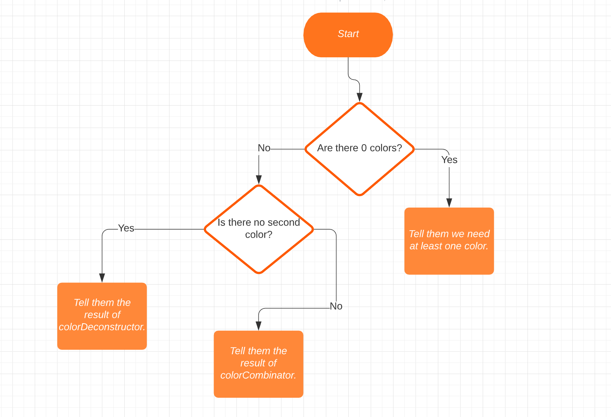
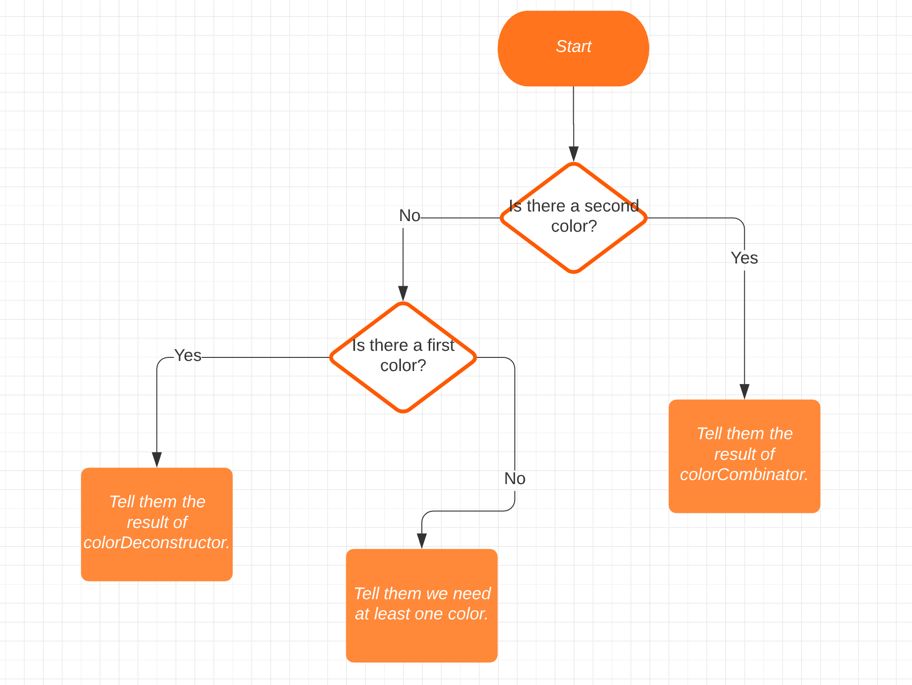

# Color Cleaver

### Introduction

This is our first chance to make the full application: color-cleaver. In the "back-end" we'll create the functions and "database" and in the "front-end" we will interact with the users.

### Workflow 

Starting with the backend, write the four functions we will be using in our code. `colorCombinator` will take two primary colors, and return to us the result of combining them. `colorDeconstructor` will take a secondary color and return to us the two primary colors that make the color up. The other two functions are for authentication purposes and will return a boolean for whether a given color is a secondary or primary color.

Make sure you pass the tests with `npm test` before wiring the front-end up!

For the front-end, you'll be working entirely in `color-cleaver.js`. Your only concern is taking input from the user's terminal (via `node color-cleaver.js [color 1] [optional color 2]`) and outputting some correct (and kind) messages.

### Steps For the Front End

1.  The first thing we need to do is grab our users' input. There might be as many as two, so grab two `getInput` return values and put them in variables.
2.  Now we'll need to take into account that some of those values might be `undefined`. Note that that's not the literal letters "undefined", it's a value--no quotes! We'll want to send them a message if BOTH are `undefined`; that means they didn't put even a single color in.
3.  If there is ONE color, we want to pass it to `colorDeconstructor`, take the return value (e.g., 'red and yellow'), and put it into a sentence that tells them the result in a user-friendly way.
4.  If there were TWO colors, then we want to get the return value from `colorCombinator` (passing in both of the users' colors) and put THAT in a sentence.
5.  Oh, but _of course_ there's one more thing: the user's input might not be `undefined`, but that doesn't mean they're _colors_. Use your `isValid` functions from the backend so that, if you're dealing with one color, you send them a message if it's not a primary color, and if you're dealing with two colors, you send them a message if EITHER isn't a secondary color.

And that's it! That's our whole front end! Although...

### Flowcharts

The steps above are in the order a person would tackle the problems. But JavaScript is not a person (sounds like a very nerdy Dark Mirror episode though), and we'll need to handle the logic in a more computer-y way.

So here are two different flowcharts; the first one is a little strange logically, but is designed to produce less nested code. The second is easier to understand, but if you follow it exactly, you'll most likely end up with nested `if` statements. It's up to you! Or make your own!

